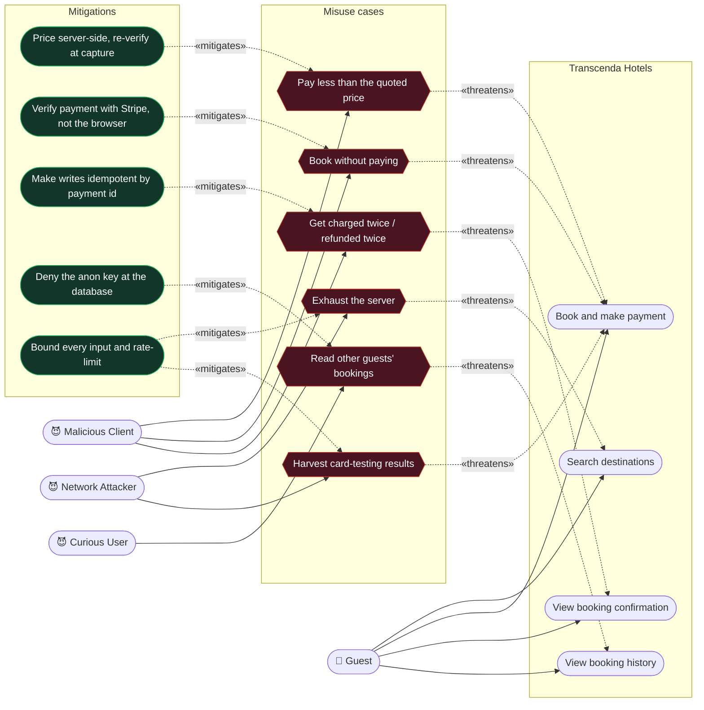

# Misuse Cases — how the system is attacked, and what holds it shut

A use case says what a legitimate actor wants. A **misuse case** says what a
hostile actor wants, and it is drawn against the same use cases so the two can
be read together: every misuse case «threatens» a use case, and every
mitigation «mitigates» a misuse case.

Everything on this page is real. Each misuse case below was either a live
defect in this codebase or an attack the design deliberately anticipated, and
each mitigation is pinned by a named test that fails if the defence is removed.
The final column of the traceability table is the receipt.

Read alongside:

- [UC4 — Book & Make Payment]({{ site.baseurl }}/UC4-Book-And-Make-Payment) — the use cases these threaten
- [Testing]({{ site.baseurl }}/Testing) — the security regression suite

---

## Misusers

| Misuser | Capability assumed |
|---|---|
| **Malicious Client** | Can craft any HTTP request. Owns the browser, so every value the client sends is under their control — query strings, JSON bodies, headers, `sessionStorage`. |
| **Network Attacker** | Can send unauthenticated requests to any public endpoint, at volume, from many addresses. Cannot read TLS traffic. |
| **Curious User** | A legitimate signed-in user who reads the JavaScript bundle and tries the credentials and endpoints they find in it. Not malicious by intent, which is why this one is easy to under-defend. |

The third is deliberate. The publishable Supabase key is in every bundle by
design, so "an ordinary user with dev-tools open" is a real threat model, not a
hypothetical one.

---

## Diagram

Misuse cases are shaded; mitigations are outlined. Dashed arrows carry the
stereotype.

---

## The six misuse cases in detail

### M1 — Pay less than the quoted price

| | |
|---|---|
| **Misuser** | Malicious Client |
| **Threatens** | UC4 Book and make payment |
| **Attack paths** | Send `price` in the query string; hide it in a nested `stay` object; name a `roomId` the catalogue does not contain so a rate is invented; send `roomId=constructor` so the rate table resolves to a function off `Object.prototype` and the total becomes `NaN`; exploit a currency bug to pay 1/100th (major vs minor units) or a zero-decimal currency scaled 100× the wrong way. |
| **Mitigation** | The server never reads a price from the caller. Rates come from the demo catalogue or the supplier, the quote is rebuilt at capture time, and the captured amount is compared against the re-derived one before a booking is written. `Object.hasOwn` is used for every rate lookup so inherited properties cannot resolve. Demo rates are disabled entirely under `NODE_ENV=production`. |
| **Evidence** | `ignores a client-supplied amount`, `ignores a price smuggled inside the stay object`, `refuses to price an unknown room type`, `does not treat inherited Object properties as room types`, `never returns a non-finite or non-positive total`, `sends the amount in minor units`, `does not scale a zero-decimal currency`, and the production-gate pair in `hotelRoomService.test.ts`. |

### M2 — Book without paying

| | |
|---|---|
| **Misuser** | Malicious Client |
| **Threatens** | UC4 Book and make payment |
| **Attack paths** | Skip the payment step and POST a made-up `session_id` to `/confirm`; forge a Stripe webhook; take a genuine signed webhook and alter the body after signing. |
| **Mitigation** | Confirmation never trusts the browser's word that payment happened — it asks Stripe, via `verifySession` / `verifyPaymentIntent`, and refuses anything not reported as paid. Webhooks are verified by HMAC over the **raw** bytes, which is why the route mounts `express.raw` before `express.json()`. |
| **Evidence** | `cannot be made to write a booking from a forged session id`, `cannot be made to write a booking from a forged intent id`, `cannot be made to write a booking from an id Stripe never issued`, `rejects a payload with no signature header at all`, `rejects a garbage signature header`, `rejects a body altered after signing`, `does nothing for a session that was never paid`. |

### M3 — Get charged twice, or refunded twice

| | |
|---|---|
| **Misuser** | Malicious Client, or an ordinary user refreshing the confirmation page |
| **Threatens** | UC5 View booking confirmation |
| **Attack paths** | Replay `/confirm` for one payment; race the browser confirmation against Stripe's webhook and its redelivery; retry a refund so the money leaves twice. |
| **Mitigation** | Writes are idempotent on `payment_id` through two in-process layers: a lock held for the duration of the write, and a `findByPaymentId` short-circuit. Refunds carry a Stripe idempotency key. The confirmation email hangs off the write hook, so it fires once per booking rather than once per caller. |
| **Evidence** | `is idempotent across repeated confirmations`, `sends the confirmation email exactly once however often it is replayed`, `does not duplicate a booking the browser already confirmed`, `sends an idempotency key so a retry cannot refund twice`, `withholds Stripe detail when a charge has already been refunded`. |
| **Residual risk** | **Both layers are per-process.** A unique constraint on `bookings.payment_id` is what would arbitrate across processes, and the database does not have one — `bookingModel`'s `23505` handler is written for a constraint that does not exist. The guard therefore holds for exactly one server instance and this misuse case reopens the moment a second replica starts. |

### M4 — Read other guests' bookings

| | |
|---|---|
| **Misuser** | Curious User |
| **Threatens** | UC7 View booking history |
| **Attack path** | Read the publishable Supabase key out of the JavaScript bundle — it is world-readable by design — and query PostgREST directly, bypassing the API entirely: no gateway, no rate limit, no ownership check. `bookings` holds guest names, emails, phone numbers, stay dates and card brand/last four. A second path is enumerating booking UUIDs against `GET /api/bookings/:id`. |
| **Mitigation** | **Partial.** The API path is guarded: booking history requires a verified token and compares the subject against the requested `userId`, and a single booking never returns card data beyond the last four. The direct-PostgREST path is **not** guarded — that needs Row Level Security on `bookings` and `profiles`, which is not enabled. |
| **Evidence** | `returns the booking and never exposes card data beyond the last four`; the auth middleware's 401/403 suite. |
| **Residual risk** | **This one is open.** Anyone who reads the publishable key out of the bundle can query `bookings` and `profiles` directly, and no application-level control can stop them — the fix has to be enforced by the database. Enabling RLS with no public policy is the remedy; it is a deliberate operational decision, not an oversight in the code. |

### M5 — Exhaust the server

| | |
|---|---|
| **Misuser** | Network Attacker |
| **Threatens** | UC1 Search destinations (and, through the event loop, every other use case) |
| **Attack path** | `GET /api/destinations/search?q=<5000 characters>`. `fuse.search` is synchronous and its cost grows with the pattern length, so a single unauthenticated request occupied the event loop for **65 seconds** — during which the process served nobody. The endpoint capped the *minimum* query length and nothing else, and was the only public route with no rate limiter. |
| **Discovery** | Found by the seeded fuzzer, not by review. No hand-written test would have tried a 5,000-character search term, because no person would type one. |
| **Mitigation** | The pattern is capped at 128 characters — the longest real destination name in the dataset is 115, so no legitimate search loses a match — and the route is rate-limited. Worst case fell from 65 s to 1.86 s and is now flat with respect to input length. Node's own 16 KB header limit answers `431` above that. |
| **Evidence** | `answers a 5,000-character query in about the time a capped one takes` and `still matches the longest real destination name in full` — a two-sided boundary pair, so the cap cannot later be tightened into a false negative — plus the endpoint fuzzer in `fuzz.test.ts`. **These land with the `test/fuzzing-and-boundaries` branch; on `development` alone the mitigation and its tests are not yet present.** |
| **Residual risk** | Bounded, not eliminated: a 115-character pattern still costs about 2 s of event loop, and the limiter permits 120 requests per minute per address. Closing it properly means moving the index off the main thread. |

### M6 — Harvest card-testing results

| | |
|---|---|
| **Misuser** | Network Attacker |
| **Threatens** | UC4 Book and make payment |
| **Attack path** | Use the payment endpoints as an oracle: submit stolen card numbers at volume and read the accept/decline responses. The victim is not this system — it is the cardholders and the Stripe account's standing. |
| **Mitigation** | Payment routes are rate-limited far more tightly than browsing routes (10/min versus 60/min for quoting). Stripe authentication failures are reported without detail, so a wrong key never renders its prefix into the payment form. The client never renders a raw card input at all — card data goes straight to Stripe, keeping the system out of PCI SAQ D scope. |
| **Evidence** | `throttles repeated payment attempts`, `withholds detail from a Stripe authentication failure`, `never renders a card input`. |

---

## Traceability

| # | Misuse case | Threatens | Mitigation | Proven by |
|---|---|---|---|---|
| M1 | Pay less than quoted | UC4 | Server-side pricing, re-verified at capture | 8 tests |
| M2 | Book without paying | UC4 | Verify with Stripe; HMAC over raw bytes | 7 tests |
| M3 | Charged/refunded twice | UC5 | Idempotency on `payment_id`, two in-process layers | 5 tests — **single-instance only** |
| M4 | Read others' bookings | UC7 | Token ownership check on the API path only | 2 tests — **direct database path open** |
| M5 | Exhaust the server | UC1 | Input cap + rate limit | 2 boundary tests + fuzzer |
| M6 | Card-testing oracle | UC4 | Tight limits, opaque errors, no card input | 3 tests |

## What this diagram deliberately does not claim

**Two misuse cases are not fully closed, and both need a database-level
control this repository does not carry.**

M4 is open at the direct-database path: the publishable key is world-readable
by design, and only Row Level Security can deny it. M3's guard is real but
per-process; a unique constraint on `bookings.payment_id` is what would make it
hold across replicas, and without one `bookingModel`'s `23505` handler catches
nothing.

Both are stated rather than glossed. A misuse-case model that quietly assumes
its own mitigations exist is worth less than one that says which do not — and
these two are the difference between "safe today at one instance" and "safe".
