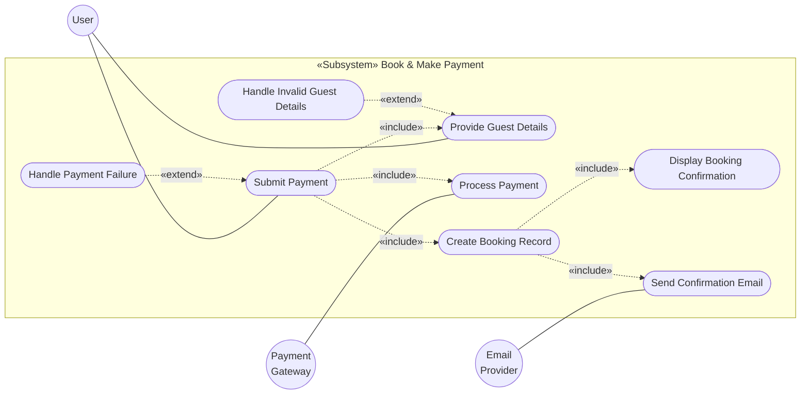
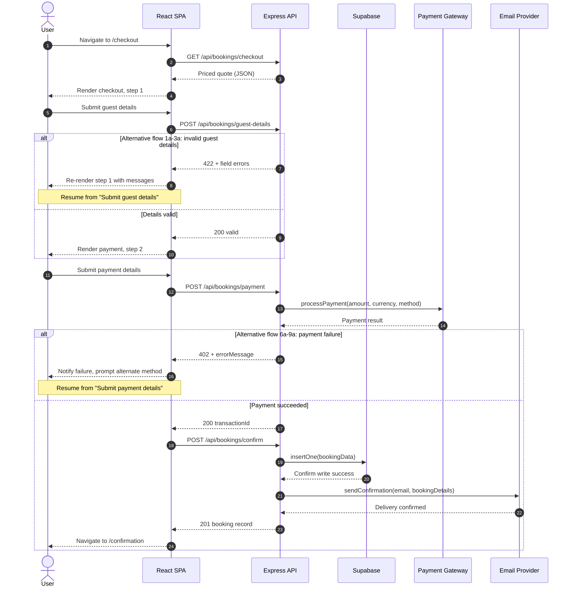

# UC4 — Book & Make Payment

Design diagrams for UC4, redrawn against the stack this repo actually runs.

The original set (`assets/`) was drawn for a server-rendered **EJS monolith with a
Mongo-style data layer**. Transcenda Hotels is a **decoupled React SPA talking to an
Express JSON gateway backed by Supabase/Postgres**. The abstractions below are
unchanged — same boxes, same responsibilities, same message ordering. Only the
mechanism each box uses has been retargeted.

## What changed, and why

| Original | Redrawn as | Reason |
| --- | --- | --- |
| `Views «EJS Templates»` | `CheckoutPage` / `ConfirmationPage` «React Page» | No `ejs` dependency; no view engine configured on the Express app |
| `render(page, data, errorMessage)` | React state (`step`, `fieldErrors`, `paymentError`) | The SPA owns rendering; the server never emits HTML |
| `2. Render checkout.ejs` | `GET /api/bookings/checkout` → JSON quote | Server returns data, client renders |
| `11. Render confirmation.ejs` | Client-side `navigate('/confirmation')` | `react-router` transition, no round trip |
| `insertOne(data)` / `findOne(query)` | **Kept verbatim** as the model's public API | Abstraction preserved; bodies now issue supabase-js SQL |
| `BookingModel «Database Model»` | `«Supabase Table»` | Postgres, not MongoDB |
| `PaymentService «External API»` | `«Stripe API»` | `stripe@^22` is already a server dependency |

Two defects in the original diagrams are corrected here:

1. **`Process Payment` was orphaned** — attached to the Payment Gateway actor but
   unreachable from `Submit Payment`. Now wired as `«include»`, matching
   `use_case.txt` step 3.
2. **`post_confirm_booking()` was unmapped** — present in the class diagram, absent
   from the sequence. It is read as sequence steps 7–10 (persist + email), split
   from `post_payment` so a successful charge is never rolled back by a failed
   database write in the same request.

---

## Use case diagram



> `Submit Payment ──«include»──> Process Payment` is the added edge.

---

## Class diagram

```mermaid
classDiagram
    direction LR

    class CheckoutPage {
        &laquo;React Page&raquo;
        -step
        -quote
        -guest
        -fieldErrors
        -paymentError
        +handleGuestSubmit(event)
        +handlePaymentSubmit(event)
    }

    class ConfirmationPage {
        &laquo;React Page&raquo;
        -booking
        +render()
    }

    class BookingController {
        &laquo;Express Router&raquo;
        +getCheckout(req, res)
        +postGuestDetails(req, res)
        +postPayment(req, res)
        +postConfirmBooking(req, res)
        +getBookingByReference(req, res)
    }

    class BookingModel {
        &laquo;Supabase Table&raquo;
        +String guestName
        +String guestEmail
        +String contactNumber
        +String roomId
        +String hotelId
        +Date checkIn
        +Date checkOut
        +Number totalPrice
        +String paymentStatus
        +String bookingReference
        +insertOne(data)
        +findOne(query)
    }

    class PaymentService {
        &laquo;Stripe API&raquo;
        +processPayment(amount, currency, paymentMethod)
    }

    class EmailService {
        &laquo;External API&raquo;
        +sendConfirmation(email, bookingDetails)
    }

    CheckoutPage --> BookingController : HTTP POST (axios)
    BookingController --> CheckoutPage : JSON quote / field errors
    ConfirmationPage --> BookingController : GET /api/bookings/:reference
    BookingController --> BookingModel : Queries / Saves booking
    BookingController --> PaymentService : Dispatches payment
    BookingController --> EmailService : Sends confirmation
```

Method names are camelCase here to match the existing `destinationController`.
Diagram-to-code mapping:

| Class diagram | Implementation |
| --- | --- |
| `get_checkout` | `getCheckout` → `GET /api/bookings/checkout` |
| `post_guest_details` | `postGuestDetails` → `POST /api/bookings/guest-details` |
| `post_payment` | `postPayment` → `POST /api/bookings/payment` |
| `post_confirm_booking` | `postConfirmBooking` → `POST /api/bookings/confirm` |

---

## Sequence diagram



### Deviations from the original ordering

- **Steps 2 and 11 are no longer HTML renders.** The server returns JSON; the SPA
  renders locally. Message *count* and *order* are otherwise unchanged.
- **Email delivery no longer gates the confirmation screen.** The original blocked
  step 11 on `Delivery confirmed`, making the success page hostage to SMTP latency.
  The booking is committed at `insertOne`; a bounce is reported as a non-blocking
  notice. `use_case.txt` postconditions do not require otherwise.

---

## Data model

DDL lives at [`server/src/data/bookings.sql`](../server/src/data/bookings.sql).

Columns map 1:1 to the `BookingModel` attributes above, plus `id` and `created_at`
that Postgres needs and the diagram omits. TypeScript stays camelCase; the
`toRow` / `fromRow` pair in `bookingModel.ts` handles the snake_case boundary.

**Deferred to UC5 (Manage Booking)** — noted in the SQL as commented migrations,
deliberately out of scope for this branch:

- `user_id` — without it, bookings cannot be tied to a Supabase auth user, so
  "view my bookings" is not implementable
- `status` — `payment_status` tracks payment, not booking lifecycle
  (`ACTIVE` / `CANCELLED_BY_HOTEL` / `COMPLETED`)
- `cancelled_at` — refund tiers have nothing to compute against without it
