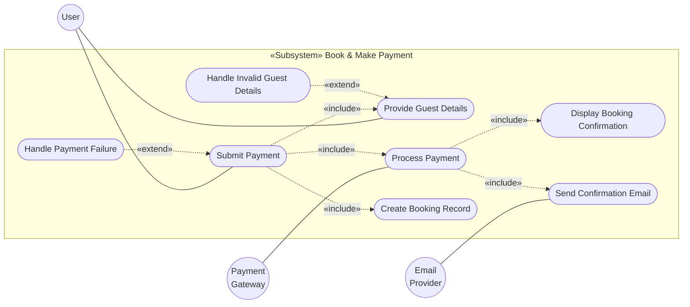
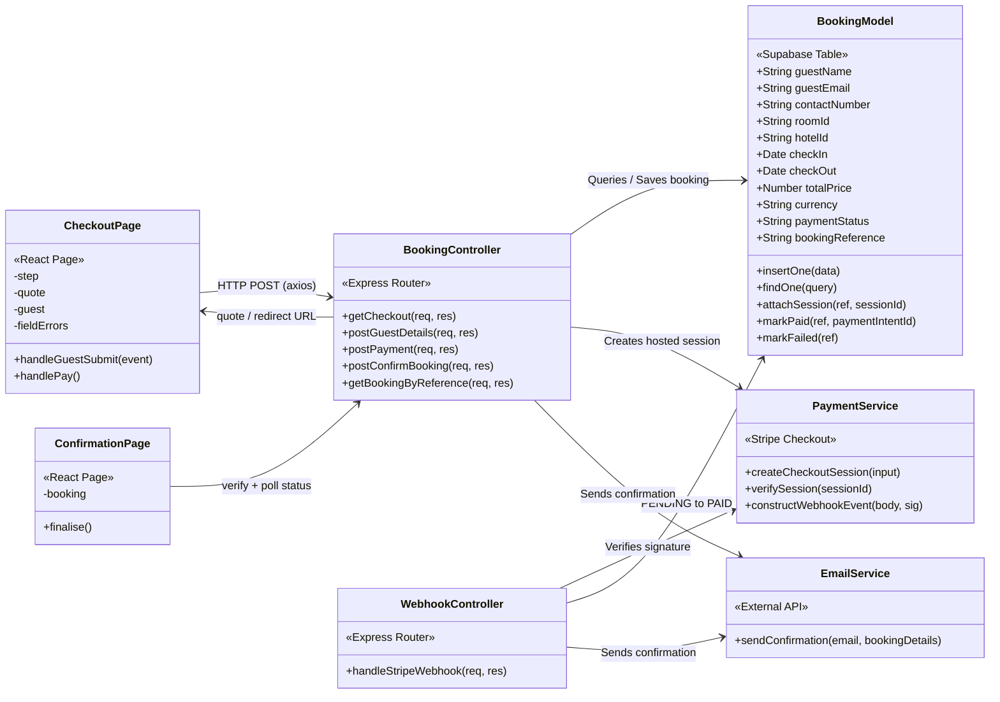
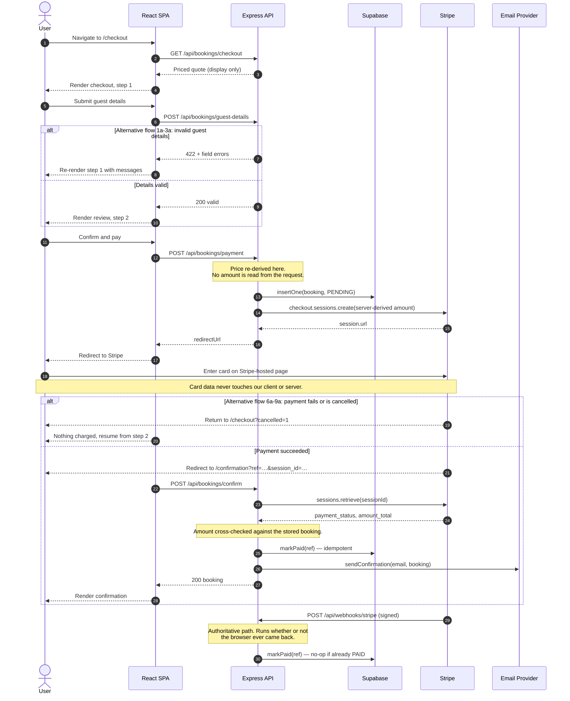

# UC4 — Book & Make Payment

Design diagrams for UC4, redrawn against the stack this repo actually runs.

The original set (`assets/`) was drawn for a server-rendered **EJS monolith with a
Mongo-style data layer**. Transcenda Hotels is a **decoupled React SPA talking to an
Express JSON gateway backed by Supabase/Postgres**. The abstractions below are
unchanged — same boxes, same responsibilities, same message ordering. Only the
mechanism each box uses has been retargeted.

## What changed, and why

| Original | Redrawn as | Reason |
| --- | --- | --- |
| `Views «EJS Templates»` | `CheckoutPage` / `ConfirmationPage` «React Page» | No `ejs` dependency; no view engine configured on the Express app |
| `render(page, data, errorMessage)` | React state (`step`, `fieldErrors`, `payError`) | The SPA owns rendering; the server never emits HTML |
| `2. Render checkout.ejs` | `GET /api/bookings/checkout` → JSON quote | Server returns data, client renders |
| `11. Render confirmation.ejs` | Redirect back from Stripe → `/confirmation` | Payment happens off-site; router state does not survive |
| `insertOne(data)` / `findOne(query)` | **Kept verbatim** as the model's public API | Abstraction preserved; bodies now issue supabase-js SQL |
| `BookingModel «Database Model»` | `«Supabase Table»` | Postgres, not MongoDB |
| `PaymentService «External API»` | `«Stripe Checkout»` | See below — the original signature required holding the card |

### Why payment no longer follows the diagram literally

The class diagram has the browser POST card details to `ExpressController`, which
passes them to `PaymentService.processPayment(amount, currency)`. Implemented as
drawn, that puts the Express server, its host, and its container inside **PCI-DSS
SAQ D** scope — roughly 300 controls, ASV scanning, and annual assessment — because
the merchant's own page collects the PAN and posts it to the merchant's own server.

Payment therefore uses **Stripe Checkout Sessions**: the server creates a session
priced from its own state, and the browser is redirected to a Stripe-hosted page.
No card number, expiry, or CVC is ever entered into, transmitted through, or held
by any part of this codebase, which keeps the platform at **SAQ A**.

`processPayment` becomes `createCheckoutSession` + `verifySession`. The «External
API» boundary — one box, owning all gateway interaction — is unchanged.

Two defects in the original diagrams are also corrected:

1. **`Process Payment` was orphaned** — attached to the Payment Gateway actor but
   unreachable from `Submit Payment`. Now wired as `«include»`.
2. **`post_confirm_booking()` was unmapped** — present in the class diagram, absent
   from the sequence. It is now the return-from-Stripe handler, verifying the
   completed session server-side.

---

## Use case diagram

> `Create Booking Record` now precedes `Process Payment`: the booking is written
> `PENDING` before the customer is sent to pay, so a completed charge can never
> arrive for a booking that does not exist.

---

## Class diagram

Method names are camelCase to match the existing `destinationController`:

| Class diagram | Implementation |
| --- | --- |
| `get_checkout` | `getCheckout` → `GET /api/bookings/checkout` |
| `post_guest_details` | `postGuestDetails` → `POST /api/bookings/guest-details` |
| `post_payment` | `postPayment` → `POST /api/bookings/payment` |
| `post_confirm_booking` | `postConfirmBooking` → `POST /api/bookings/confirm` |

---

## Sequence diagram

### Deviations from the original ordering

- **Steps 2 and 11 are no longer HTML renders.** The server returns JSON; the SPA
  renders locally.
- **Email delivery no longer gates the confirmation screen.** The original blocked
  step 11 on `Delivery confirmed`, making the success page hostage to SMTP latency.
- **The booking is written before payment, not after.** This is the inverse of the
  original sequence, and it is what removes the charge-succeeded-but-write-failed
  hole: there is always a row to reconcile a payment against.
- **A webhook was added.** The original has no asynchronous path, which under
  PSD2/SCA means any payment needing a 3DS challenge would never complete.

---

## Security properties

Verified by exercising the running API:

| Property | How it is enforced |
| --- | --- |
| Card data never reaches us | Stripe-hosted Checkout; no card fields exist in the client |
| Price cannot be manipulated | `buildQuote()` re-derives every amount server-side; `amount` and `totalPrice` in a request body are ignored |
| Payment cannot be forged | `postConfirmBooking` retrieves the session from Stripe and matches `client_reference_id` and `amount_total` |
| Missing credentials cannot silently pass | Payment endpoints 503 unless `PAYMENTS_MODE=simulate`; production refuses to boot without `STRIPE_SECRET_KEY` |
| Webhooks cannot be spoofed | `constructEvent` signature verification, mounted on `express.raw` before the JSON parser |
| Confirmation is idempotent | `markPaid` guards on `payment_status = 'PENDING'`, so redelivery is a no-op and the email sends once |
| Unknown rooms are not priced | `ROOM_RATES` lookup; unknown `roomId` returns 400 |
| Card testing is throttled | 10 requests/min per IP on `/payment`, 30/min on lookup |
| Errors leak nothing | Stripe messages mapped to an allowlist; everything else returns a correlation ID |

### Still open

- **`ROOM_RATES` is a placeholder.** `AscendaService.searchHotels` on
  `feature/search-results` is the real source — `MergedHotel.price`. Wire it into
  `buildQuote()` once that branch merges.
- **Booking lookup is unauthenticated.** References are 10 characters from a
  32-symbol alphabet (~10^15) and rate-limited, but that is mitigation, not
  authentication. UC5 needs `user_id` and a session check.
- **HTTPS is not enforced in code.** `helmet` and HSTS need a dependency the
  branch cannot add; must be handled at the ingress.
- **No automated tests cover this flow.** Everything above was verified manually.

---

## Data model

DDL lives at [`server/src/data/bookings.sql`](../server/src/data/bookings.sql),
including the migration for anyone who already created the earlier table shape.

**Deferred to UC5 (Manage Booking)** — commented in the SQL, out of scope here:
`user_id`, `status`, `cancelled_at`.
