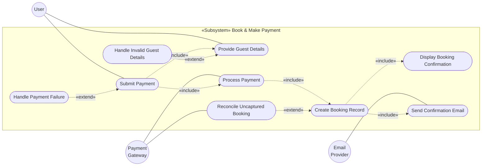
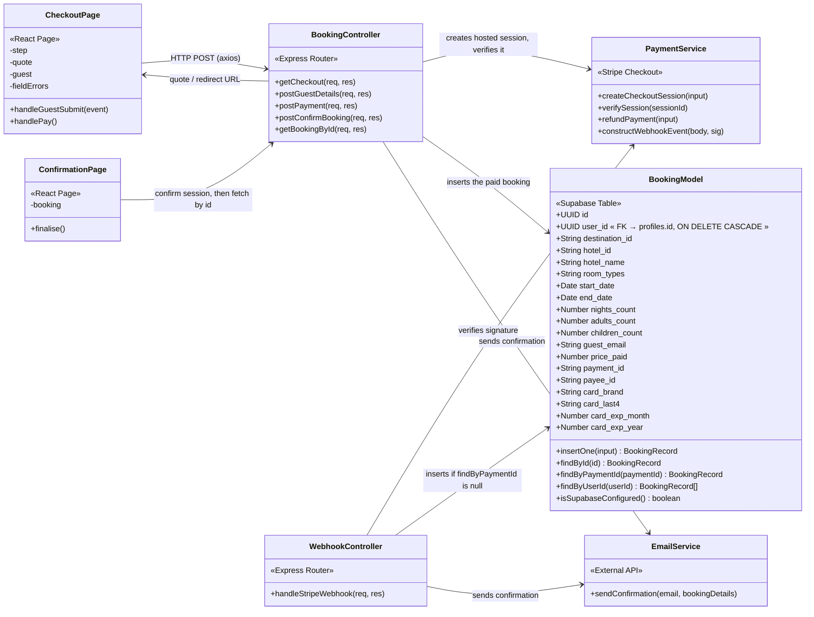
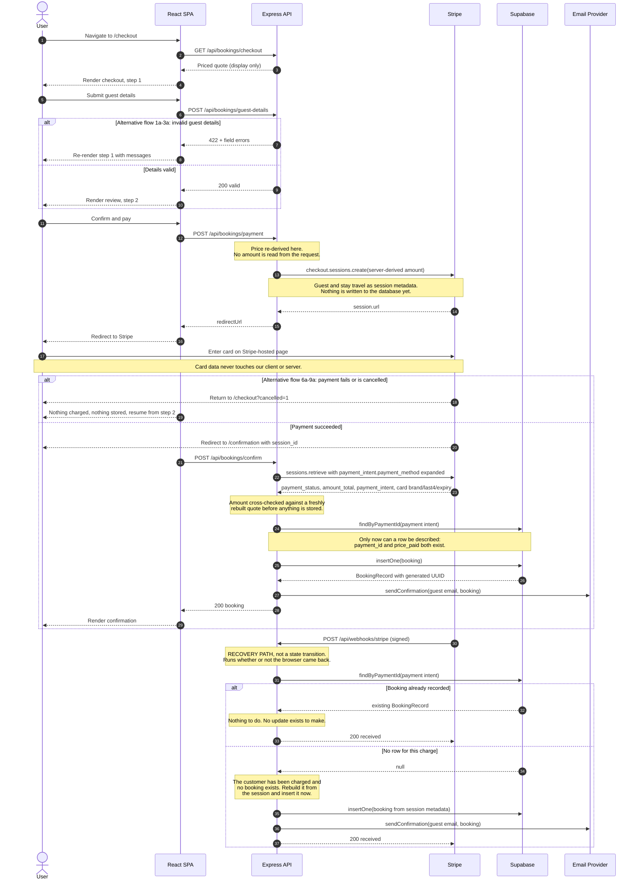
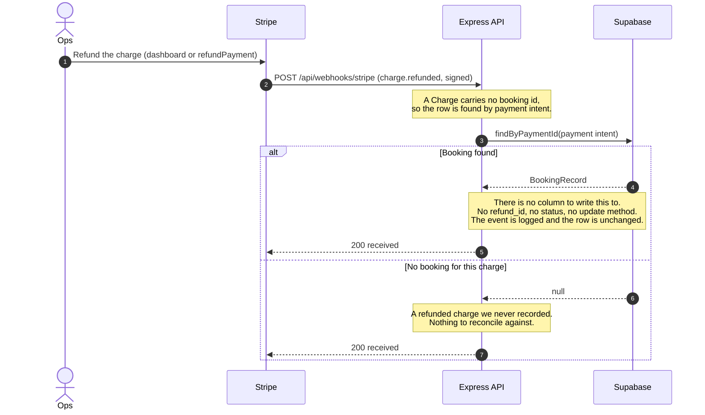

# UC4 — Book & Make Payment

Design diagrams for UC4, redrawn against the stack this repo actually runs.

The original set (`assets/`) was drawn for a server-rendered **EJS monolith with a
Mongo-style data layer**. Transcenda Hotels is a **decoupled React SPA talking to an
Express JSON gateway backed by Supabase/Postgres**. The abstractions below are
unchanged — same boxes, same responsibilities. Only the mechanism each box uses has
been retargeted, and — since the schema landed — the message ordering.

## What changed, and why

| Original | Redrawn as | Reason |
| --- | --- | --- |
| `Views «EJS Templates»` | `CheckoutPage` / `ConfirmationPage` «React Page» | No `ejs` dependency; no view engine configured on the Express app |
| `render(page, data, errorMessage)` | React state (`step`, `fieldErrors`, `payError`) | The SPA owns rendering; the server never emits HTML |
| `2. Render checkout.ejs` | `GET /api/bookings/checkout` → JSON quote | Server returns data, client renders |
| `11. Render confirmation.ejs` | Redirect back from Stripe → `/confirmation` | Payment happens off-site; router state does not survive |
| `BookingModel «Database Model»` | `«Supabase Table»` | Postgres, not MongoDB |
| `insertOne(data)` | **Kept** — but now called *after* the charge | See below; the table cannot represent an unpaid booking |
| `findOne(query)` | Split into `findById` / `findByPaymentId` / `findByUserId` | A generic query object over a typed Postgres row buys nothing; each caller wants one of exactly three lookups |
| `PaymentService «External API»` | `«Stripe Checkout»` | The original signature required holding the card |
| — | *(none)* | `bookings.user_id` references `profiles`, but no code reads that table — see below |

### Why payment no longer follows the diagram literally

The class diagram has the browser POST card details to `ExpressController`, which
passes them to `PaymentService.processPayment(amount, currency)`. Implemented as
drawn, that puts the Express server, its host, and its container inside **PCI-DSS
SAQ D** scope — roughly 300 controls, ASV scanning, and annual assessment — because
the merchant's own page collects the PAN and posts it to the merchant's own server.

Payment therefore uses **Stripe Checkout Sessions**: the server creates a session
priced from its own state, and the browser is redirected to a Stripe-hosted page.
No card number or CVC is ever entered into, transmitted through, or held by any part
of this codebase, which keeps the platform at **SAQ A**.

`processPayment` becomes `createCheckoutSession` + `verifySession`. The «External
API» boundary — one box, owning all gateway interaction — is unchanged.

Two defects in the original diagrams are also corrected:

1. **`Process Payment` was orphaned** — attached to the Payment Gateway actor but
   unreachable from `Submit Payment`. Now wired as `«include»`.
2. **`post_confirm_booking()` was unmapped** — present in the class diagram, absent
   from the sequence. It is now the return-from-Stripe handler, verifying the
   completed session server-side and writing the booking.

---

## The schema inverted the flow

This is the change that matters most, and everything below follows from it.

[`server/src/data/schema.sql`](../server/src/data/schema.sql) declares `bookings`
with `payment_id` and `price_paid` **`NOT NULL`** and **no status column**. A row
in that table cannot describe a booking that has not been paid for — there is no
value to put in `payment_id`, and no state to mark it with. So the order reverses:

| | Old flow | New flow |
| --- | --- | --- |
| 1 | Insert booking as `PENDING` | Create Stripe session; **write nothing** |
| 2 | Redirect to Stripe | Redirect to Stripe |
| 3 | Charge clears | Charge clears |
| 4 | Webhook flips `PENDING → PAID` | **Insert the booking, now that it can be described** |
| Handle | `booking_reference` (`TRX-…`) | `id` (UUID, DB-generated) |
| Proof of payment | `payment_status = 'PAID'` | The row's existence |

The gain is that the database no longer holds rows for money nobody sent — no
abandoned-checkout debris, no `PENDING` rows to sweep, no state machine to keep
honest. What used to be a status transition is now an insert, and inserts are far
easier to reason about than transitions.

The costs are real, and are set out honestly below rather than buried.

### A charge can now be captured with no booking row

This is the direct inverse of the old design's guarantee, and it should be read as
a regression, not a trade.

Under the old flow the row existed before the customer ever reached Stripe, so a
successful charge always had something to attach to; the worst case was a `PENDING`
row that never advanced — visible, queryable, harmless. Under the new flow the
charge lands first. If the insert then fails — Supabase unreachable, wrong key,
constraint violation, process killed between the two calls — the money is captured
and the booking does not exist. The customer has a card statement and we have
nothing.

**The webhook is the recovery path for this, and recovery is not prevention.**
`handleStripeWebhook` arrives independently of the browser, calls `findByPaymentId`,
and inserts the booking if the lookup returns null. That closes the common cases:
browser closed mid-redirect, 3DS challenge completed later, a transient database
blip during confirmation. It does not close the case where the database is durably
unable to accept the write, because Stripe's retry schedule is finite and no amount
of retrying fixes a table that is not there. The old design could not produce this
failure at all. Anyone reviewing this flow should weigh that.

Two things keep it manageable: the booking is fully reconstructible from the Stripe
session (guest and stay details travel in session metadata, so recovery does not
depend on any local state surviving), and `payment_id` gives operations a join key
between a Stripe dashboard charge and a row that should exist. Neither is a
substitute for the write succeeding.

### Idempotency is narrowed, not closed

`insertOne` calls `findByPaymentId` first and returns the existing row if there is
one. That makes a retried confirmation or a redelivered webhook a no-op in
practice — but it is a read-then-write, and two concurrent deliveries can both read
null before either writes. The deployed schema has **no unique constraint on
`payment_id`**, so nothing at the database level stops the second insert. The
observable result is two paid bookings for one charge.

`schema.sql` carries the fix as a one-liner:

```sql
alter table public.bookings
  add constraint bookings_payment_id_key unique (payment_id);
```

**This is the single highest-value change to make to this system.** It converts the
race from "duplicate row" into "insert fails, caller reads the winner", and it is
also what makes webhook-driven recovery airtight rather than merely likely. It is
one statement, it is already written down, and it is not applied.

### Refunds have nowhere to go

There is no `refund_id` column and no status column, so **a refunded booking still
reads as paid** — indistinguishable from one where the guest is arriving on Friday.
The `charge.refunded` webhook can find the row by payment intent and can log it, but
it cannot record it. Reconciling refunds today means reading the Stripe dashboard,
not the database.

### The customer-facing handle is a UUID

`booking_reference` is gone; the handle is the primary key, a DB-generated UUID like
`f47ac10b-58cc-4372-a567-0e02b2c3d479`. This is better as a key — no collision
logic, no generator to test, no enumerable format — and **worse as a reference**.
`TRX-8H2K9QX4M1` could be read over the phone, written on a receipt, or typed into a
support form. A UUID cannot: 36 characters, four hyphens, hex that mishears as
easily as it mistypes. Any support workflow that involves a human reading a booking
number aloud is materially worse than it was. If that workflow matters, the fix is a
short human-facing reference derived from or stored alongside the UUID — not a
revert.

---

## Use case diagram



> `Process Payment` now precedes `Create Booking Record`, reversing the previous
> revision of this diagram. `Reconcile Uncaptured Booking` is the extension that
> exists only because of that reversal: it is the webhook writing a booking for a
> charge the confirmation request failed to record.

---

## Class diagram



Three things to read off this diagram.

**`BookingModel` has no mutators.** There is no `markPaid`, no state transition, no
update of any kind — one write method and three reads. That is the schema's shape
showing through: a row is created complete or not at all.

**`WebhookController --> BookingModel` is a conditional insert, not an update.** In
the previous revision that edge was a state change. It is now the recovery path
described above, and it fires only when `findByPaymentId` comes back null.

**There is no `ProfileModel`.** An earlier revision drew `BookingController -->
ProfileModel : resolves user_id before insert`, and that call was never written:
the module existed, was fully unit-tested, and was imported by nothing. It has
been deleted. `user_id` is checked for UUID shape and written straight through,
so a malformed one still surfaces as a constraint violation *after* the card is
charged rather than before — the gap the arrow implied was closed.

**`bookings.user_id` is still `ON DELETE CASCADE` onto `profiles`.** The table and
the constraint are real — see `schema.sql` — which is why the annotation sits on
the field rather than on a class. Deleting an account deletes its bookings, which
is discussed under [Data model](#data-model) and is not obviously what anyone
wants.

Method names are camelCase to match the existing `destinationController`:

| Class diagram | Implementation |
| --- | --- |
| `get_checkout` | `getCheckout` → `GET /api/bookings/checkout` |
| `post_guest_details` | `postGuestDetails` → `POST /api/bookings/guest-details` |
| `post_payment` | `postPayment` → `POST /api/bookings/payment` |
| `post_confirm_booking` | `postConfirmBooking` → `POST /api/bookings/confirm` |
| — | `getBookingById` → `GET /api/bookings/:id` |

---

## Sequence diagram



### Deviations from the original ordering

- **Steps 2 and 11 are no longer HTML renders.** The server returns JSON; the SPA
  renders locally.
- **Email delivery no longer gates the confirmation screen.** The original blocked
  step 11 on `Delivery confirmed`, making the success page hostage to SMTP latency.
- **The booking is written after payment, not before.** This reverses the previous
  revision of this document. It removes the unpaid-row problem and introduces the
  orphaned-charge problem; both are stated above rather than netted off.
- **The webhook is a recovery path, not the authoritative state channel.** It no
  longer advances a booking through states — there are none. It answers one
  question: does a row exist for this charge, and if not, why is it not being
  written now.
- **The webhook is still what makes SCA work.** Under PSD2, a 3DS challenge can
  complete long after the browser has gone. Without an asynchronous path those
  bookings would simply never be recorded.

---

## Refunds

`refundPayment()` exists in `PaymentService` and issues a correct, idempotency-keyed
refund against Stripe. What is missing is anywhere to write the outcome down.

| Path | Trigger | Effect on the database |
| --- | --- | --- |
| `refundPayment()` | Called in code | Money returns. **No row changes.** |
| `charge.refunded` webhook | Refund issued from the Stripe dashboard | Row is located and logged. **No row changes.** |



**A refunded booking is indistinguishable from a live one.** It has a
`payment_id`, a `price_paid`, and a `created_at`, exactly as it did before the money
went back. Any query that counts revenue, any "my bookings" list, and any front-desk
arrivals report will include it. This is a correctness problem, not a cosmetic one,
and it is the second thing to fix after the unique constraint.

The minimum shape of the fix is a nullable `refunded_at` plus a nullable `refund_id`,
which stays faithful to the "a row means money was taken" invariant while recording
that some of it went back. A full status column would reintroduce the state machine
the schema deliberately removed.

**There is deliberately no refund endpoint.** Issuing money back needs an
authenticated owner and a cancellation policy, both UC5 concerns; exposing it now
would be an unauthenticated "refund anyone's booking" route.

Full refunds omit the amount entirely rather than sending a locally computed total,
which can drift from what Stripe actually captured and leave cents behind.

---

## Card metadata and PCI scope

The `bookings` table stores `card_brand`, `card_last4`, `card_exp_month`, and
`card_exp_year`. That is deliberate, and it does not change the platform's PCI
position.

PCI-DSS distinguishes the primary account number and authentication data from the
rest. **PAN and CVC may not be stored** — CVC may not be retained after
authorisation under any circumstances, by anyone. **Brand, last four digits, and
expiry are explicitly permitted** to be stored, which is why every payment receipt
you have ever received shows exactly those four things.

Just as importantly, we never *collect* them. The values are read back from Stripe
after the charge has settled, by expanding `payment_intent.payment_method` on the
retrieved session. No card field is rendered by our client, submitted to our server,
or present in any request our code handles. The application's exposure to card data
is a read of four already-permitted attributes from an API response.

The platform therefore remains at **SAQ A**. Storing these fields would only change
that if we also touched the PAN — and there is no code path in this repository that
could, because there is nowhere for a PAN to enter.

They exist to be displayed: "Visa ending 4242, expires 03/29" on the confirmation
page is what tells a guest which of their cards was charged.

---

## Security properties

Verified by exercising the running API, and held by the test suites named in
[Testing]({{ site.baseurl }}/Testing):

| Property | How it is enforced |
| --- | --- |
| Card data never reaches us | Stripe-hosted Checkout; no card fields exist in the client. Brand/last4/expiry are read back from Stripe, never collected |
| Price cannot be manipulated | `buildQuote()` re-derives every amount server-side; any `amount` or `totalPrice` in a request body is ignored |
| An unpaid booking cannot be stored | `payment_id` and `price_paid` are `NOT NULL`; there is no code path that inserts without a settled charge |
| Payment cannot be forged | `postConfirmBooking` retrieves the session from Stripe and matches `amount_total` against a rebuilt quote before inserting |
| Missing credentials cannot silently pass | Payment endpoints 503 unless `PAYMENTS_MODE=simulate`; production refuses to boot without `STRIPE_SECRET_KEY` |
| Webhooks cannot be spoofed | `constructWebhookEvent` signature verification, mounted on `express.raw` before the JSON parser |
| A captured charge is not silently lost | The webhook inserts when `findByPaymentId` returns null — recovery, and only for as long as Stripe retries |
| Confirmation is *mostly* idempotent | `insertOne` short-circuits on `findByPaymentId`. Read-then-write: it narrows the duplicate window, it does not close it. See the unique constraint in `schema.sql` |
| Unknown rooms are not priced | `ROOM_RATES` lookup; an unknown room type returns 400 |
| Card testing is throttled | 10 requests/min per IP on `/payment`, 30/min on lookup |
| Errors leak nothing | Stripe messages mapped to an allowlist; storage faults return a correlation ID and log the cause |
| Amounts are sent in the right unit | `toMinorUnits` handles zero- and three-decimal currencies; asserted against the real request body under nock |
| Refunds cannot double-issue | Stripe idempotency key derived from the payment intent |

Two rows above are deliberately hedged. "Mostly idempotent" and "not *silently* lost"
are the honest strength of those guarantees, and writing them as unqualified wins
would be the most misleading thing in this document.

### Still open

- **`payment_id` has no unique constraint.** One `alter table`, already written out
  in `schema.sql`. Highest-value change available; everything about duplicate
  bookings depends on it.
- **Refunds cannot be recorded.** A refunded booking reads as paid. Needs
  `refunded_at` and `refund_id`.
- **`ON DELETE CASCADE` deletes paid booking history.** See below.
- **The customer-facing handle is a UUID.** A real usability regression for phone
  and email support; needs a short human-readable reference if that workflow matters.
- **The controller layer has not caught up with the model layer.**
  [`bookingController.ts`](../server/src/controllers/bookingController.ts) and
  [`webhookController.ts`](../server/src/controllers/webhookController.ts) still
  import the pre-schema model API and still write a booking before redirecting to
  Stripe. The schema, [`bookingTypes.ts`](../server/src/models/bookingTypes.ts),
  [`bookingModel.ts`](../server/src/models/bookingModel.ts) and the client types are
  on the new shape; the controllers are not. This document describes the design the
  schema and models define, which is the target — read the controllers as work in
  progress, not as a contradiction of the diagrams above.
- **Booking lookup is unauthenticated.** A UUID is unguessable, which is genuinely
  better than an enumerable reference, but unguessability is not authentication.
  UC5 needs a session check against `user_id`.
- **No row-level security.** Writes go through the service role from the Express
  gateway, so enabling RLS with no public policy costs nothing and closes direct
  client access to other people's bookings. Statements are in `schema.sql`.
- **No index on `user_id` or `guest_email`.** Fine at current volume, not fine for
  "my bookings" at scale. Also in `schema.sql`.
- **`ROOM_RATES` is a placeholder.** `AscendaService.searchHotels` on
  `feature/search-results` is the real source — `MergedHotel.price`. Wire it into
  `buildQuote()` once that branch merges.
- **HTTPS is not enforced in code.** `helmet` and HSTS need a dependency the branch
  cannot add; must be handled at the ingress.
- **The live Stripe integration has never run against Stripe.** nock proves the
  requests we build and the responses we parse are right, which is what the
  simulator could never do — but a faked wire is still a faked wire. One pass with
  `stripe listen` and a real test key remains worth doing before launch.
- **Partial refunds are neither recorded nor acted on.** With no refund columns
  there is currently no difference between a partial refund and a full one from the
  database's point of view. Deciding what a part-refund means for a stay is UC5.

---

## Data model

DDL lives at [`server/src/data/schema.sql`](../server/src/data/schema.sql), which is
the source of truth for both tables and carries the recommended-but-unapplied
migrations at the bottom. The TypeScript mirror is
[`server/src/models/bookingTypes.ts`](../server/src/models/bookingTypes.ts); the
client's copy is [`client/src/types/booking.ts`](../client/src/types/booking.ts). A
column change starts in the SQL and propagates outward in that order.

### `bookings`

One row per **completed, paid** reservation. There is no other kind.

| Group | Columns | Notes |
| --- | --- | --- |
| Identity | `id` | UUID, `gen_random_uuid()`. The customer-facing handle |
| Ownership | `user_id` | Nullable — guest checkout is supported. FK to `profiles` |
| Stay | `destination_id`, `hotel_id`, `hotel_name`, `room_types`, `start_date`, `end_date`, `nights_count`, `adults_count`, `children_count` | `room_types` is comma-joined text; `bookingModel` owns the split |
| Guest | `guest_salutation`, `guest_first_name`, `guest_last_name`, `guest_email`, `guest_phone`, `special_requests` | Split names, matching the form |
| Payment | `price_paid`, `payment_id`, `payee_id` | All `NOT NULL`. `payment_id` is the Stripe PaymentIntent and the reconciliation key |
| Card | `card_brand`, `card_last4`, `card_exp_month`, `card_exp_year` | PCI-permitted fields only, read back from Stripe |
| Audit | `created_at` | UTC |

`card_last4` is `character(4)`, which Postgres blank-pads. `bookingModel` normalises
on write and trims on read so callers never see the padding — a small thing that
would otherwise produce a stray space in the UI.

There is no `payment_status`, no `currency`, no `refund_id`, and no
`booking_reference`. Each absence is a decision recorded above.

### `profiles`

New. One row per authenticated user, with `id` a foreign key onto `auth.users(id)` —
the application-visible half of a Supabase auth account, readable and joinable
without reaching into the auth schema.

`bookings.user_id` references it **`ON DELETE CASCADE`**.

That means deleting an account deletes that person's paid booking history along with
it. This is the schema's stated intent and it is a defensible reading of a
data-deletion request, but **paid bookings are financial records and usually need to
outlive the account that created them** — for tax and accounting retention, for
chargeback defence, and simply so a guest with a reservation next month still has one
after closing their web login. The GDPR right to erasure has explicit carve-outs for
legal-obligation retention; a blanket cascade does not use them.

`ON DELETE SET NULL` preserves the booking as an anonymous paid stay and is the
usual answer. Worth settling before any account-deletion flow is built, because
after that it is a data-loss bug rather than a schema choice.

**Deferred to UC5 (Manage Booking):** cancellation, amendment, and the authenticated
ownership check that makes lookup by `id` safe to expose.
